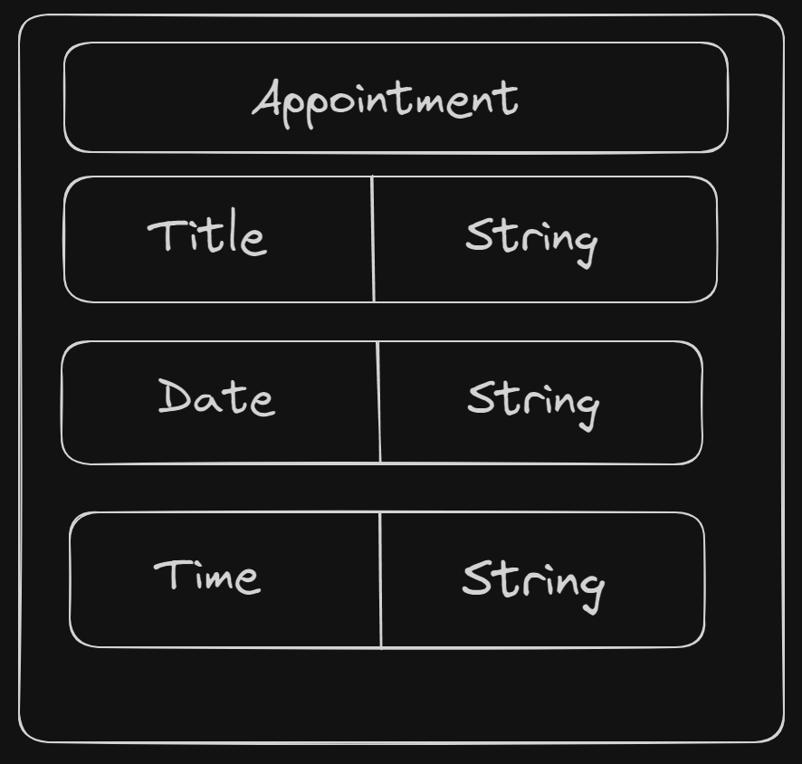

## App Desc: Users will be able to keep track of appointments that the user has during a week long time period. The index page will display the appointments that have been added to the user's list with the titles, dates, and times. The index and show pages will also have a footer where the user can view the developer's linkedIn, Image, and Portfolio. The user will be able to add an appointment with a title, date, and time using the Create Button on the index page. The user will be able change the title, date, or time of an existing appointment using the Update Button on the show page. The user will be able to remove an entire appointment from their list using the Delete Button on the show page.

## Deployed Site - (https://apps-back.onrender.com/list/)

## Dependencies - 
- Django
- Django Rest Framework
- dj_database_url
- environ
- os
- psycopg2-binary
- gunicorn

## ERD 

## Route Map -
| Route Name | Endpoint | Method | Description            |
| ---------- | -------- | ------ | ---------------------- |
| Index | / | GET | All appointments |
| Show | /:id | GET | Details for One appointment |
| Create | / | POST | Add an appointment |
| Update | /:id | PUT | Change an appointment |
| Delete | /:id | DELETE | Remove an appointment |

